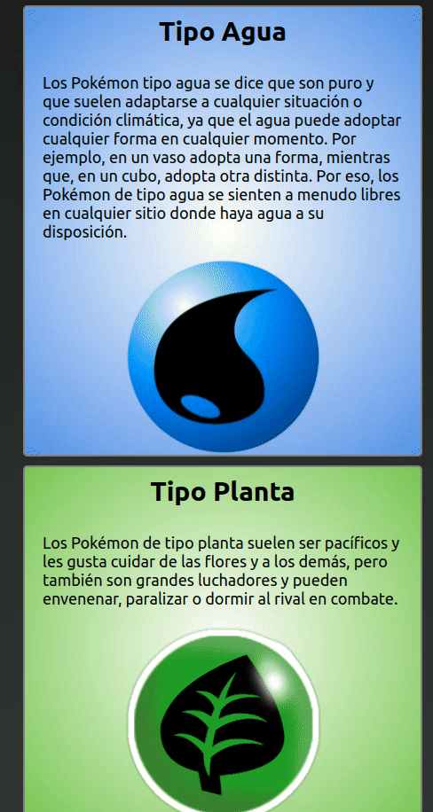

# Tarea

Para esta tarea tenemos como objetivo construir la siguiente aplicación  

## PokeTypeReload

Debe completar el archivo js/script.js para que la app realice lo que se ve en el gif, utilizando como datos los visto en el ejercicio anterior.